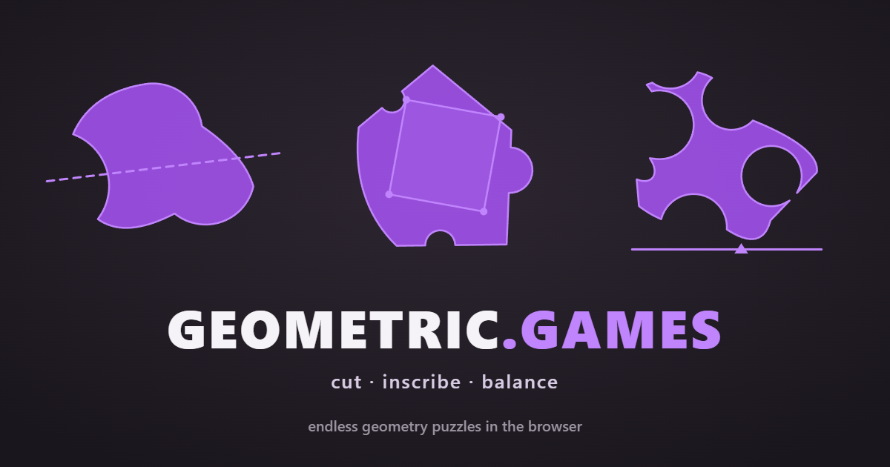

# geometric.games

**Cut, inscribe, and balance shapes. Endless geometry puzzles in the browser.**

### ▶ [**Play now at geometric.games**](https://geometric.games/)

No install. No sign-up. No ads. Just shapes and a straight line.

---

## What is this?

Every round, the game draws a fresh irregular shape — sometimes with a hole punched through it — and gives you one geometric task to solve. You drag, tap, and drop until your answer matches the true math, then press **Confirm** to score how close you got.

It's a small browser game built around a simple idea: **classical geometry makes surprisingly good puzzles**. Under every mode there's a real theorem — the Intermediate Value Theorem, Toeplitz's Inscribed Square Problem (still open after 110+ years!), Courant–Robbins four-piece partition, centroids with holes — and you're essentially playing the proof by hand.

Shapes are generated from random seeds, so you never run out. Or pick the **Daily** option and everyone plays the same shape of the day.

---

## The three modes

### ✂️ Cut — *slice a shape with straight lines*

| Variation | Goal |
|---|---|
| **Half** | One straight line that splits the shape into two equal halves by area. |
| **Target Ratio** | Cut in a random target ratio (5/95 … 50/50) shown at the top each round. |
| **Quad Cut** | Two lines that cross *inside* the shape, producing four equal pieces. |
| **Tri Cut** | Two lines that produce three equal pieces — the second cut must leave one half whole. |
| **Constrained Angle** | The line's angle is fixed. Slide it until you find the 50/50 spot. |

> *Math behind it:* by the Intermediate Value Theorem, every region has a 50/50 bisector in **every** direction — perfection is always reachable, from any angle you like.

### ◻️ Inscribe — *place points on the outline*

| Variation | Goal |
|---|---|
| **Square** | Place four points on the outline to form the closest possible square. |
| **Equilateral Triangle** | Place three points forming a triangle with equal sides and 60° angles. |

> *Math behind it:* Toeplitz's 1911 Inscribed Square Problem asks whether every closed curve contains 4 points forming a square. Proven for polygons, smooth curves, and piecewise-smooth curves like the ones here — but for arbitrary Jordan curves it's **still open**. The equilateral-triangle case is fully settled (Nielsen & Wright, 1990).

### ⚖️ Balance — *find the center of gravity*

| Variation | Goal |
|---|---|
| **Pole Balance** | Slide a pole under the shape so it balances and doesn't tip. |
| **Centroid** | Tap the board where you think the center of mass is. |

> *Math behind it:* a shape's centroid doesn't have to lie inside the shape — for an annulus it sits at the empty center. Holes and non-convex outlines are where intuition breaks.

---

## How to play

1. Open [geometric.games](https://geometric.games/) — works on phone, tablet, and desktop.
2. A shape appears. The hint at the bottom tells you what to do in the current mode.
3. **Drag** to draw a cut, or **tap** to place points / pole / centroid guesses.
4. Fine-tune: drag endpoints, points, or the pole to nudge your answer.
5. Press **Confirm** to score.
6. Tap **New Shape** for the next puzzle, or **Change Puzzle** to swap mode or variation.

Use the **?** button for a per-mode tutorial, and the **📊** button for your stats.

---

## Features

- 🎲 **Endless** — random-seed shape generator, so the well never runs dry
- 📅 **Daily puzzle** — optional: same shape for everyone, once per mode per day
- 📈 **Stats** — rounds played, best score, average, perfect streaks, per mode
- 📤 **Share** — copy your result as an image to share the shape + your answer
- 📱 **Installable** — add to home screen, runs offline as a PWA
- 🎯 **No accounts** — everything lives in your browser, nothing to sign up for
- 🧠 **Real math** — every mode links to a short blog post explaining the theorem

---

## Why

Most geometry puzzles are textbook exercises with a single right answer you're supposed to recognize. This game flips it: you know what "equal halves" or "a square" means intuitively, and the fun is in the *doing* — training your eye to see the bisector, the hidden square, the balance point. The score is always a number in [0, 1] telling you exactly how close you got, so it scratches the same itch as golf: chasing perfect.

Play at **[geometric.games](https://geometric.games/)**.
